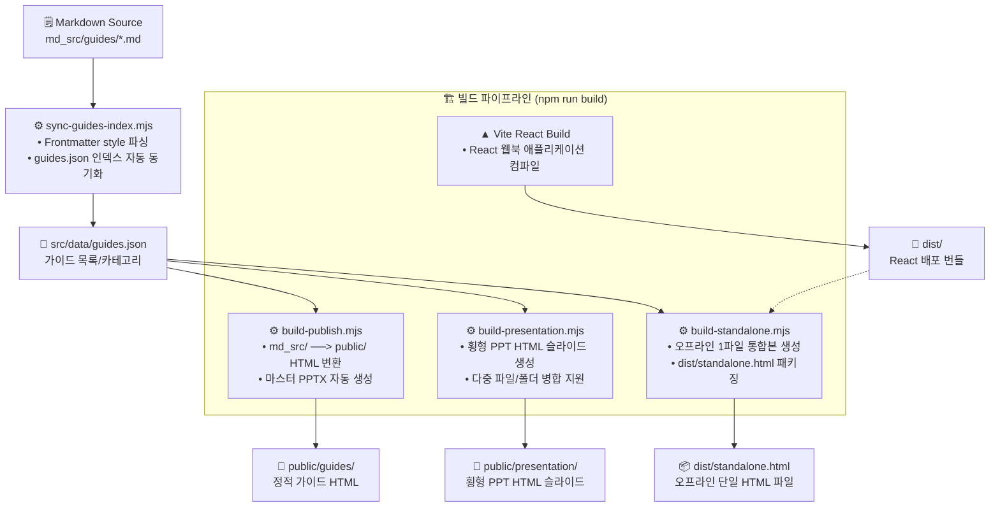

# 📚 Creative Spark — AI Tool Guides & Presentation Engine

[](https://nodejs.org/)
[](https://react.dev/)
[](https://vite.dev/)
[](https://tailwindcss.com/)
[](LICENSE.txt)

> **마크다운 가이드북 ──> React 반응형 웹북 & Standalone 오프라인 1파일 & PPT형 횡 슬라이드 HTML 통합 자동화 엔진**  
> AI 도구(Cursor, Claude, Supabase 등)에 대한 정밀 가이드 문서를 마크다운으로 편집하면, 풍부한 시각적 숏코드(Shortcode)가 주입된 웹 리더, 횡형 슬라이드 프리젠테이션 및 100% 무설치 단일 오프라인 HTML 파일로 자동 번들링됩니다.

---

## 🌐 서비스 구동 및 배포 환경

| 환경 | 접속/구동 경로 | 상태 |
| :--- | :--- | :--- |
| **로컬 개발 서버 (React)** | http://localhost:5173 | 실시간 핫 리로딩 지원 |
| **로컬 가이드북 빌드 결과** | `dist/index.html` (Vite 빌드 번들) | 로컬 배포 패키지 |
| **통합 Standalone HTML** | [dist/standalone.html](file:///c:/ai/creative-spark/dist/standalone.html) | 오프라인용 단일 파일 (무설치 기동) |
| **PPT형 횡 슬라이드 뷰어** | `public/presentation/*.html` | 키보드 내비게이션 지원 PPT HTML |
| **파워포인트 다운로드** | `public/pptx/*.pptx` | PPTXGenJS 생성 프레젠테이션 파일 |

---

## ✨ Key Features

- **🧠 Markdown to Interactive Webbook** — 24종의 풍부한 시각화 숏코드(숏코드: `git-flow-strip`, `editor-box`, `network-box`, `part-deck`, `chapter-list`, `summary-bar` 등)를 마크다운에 주입하여 즉시 반응형 컴포넌트로 렌더링.
- **📁 Dynamic Indexing Automation (`sync:guides`)** — 마크다운의 Frontmatter를 자동 수집하여 `guides.json` 인덱스 카테고리 자동 갱신. 사용자가 변경한 정렬 순서 및 커스텀 메타데이터는 100% 영구 보존.
- **📽️ Horizontal Snap Presentation (`build:slide`)** — H1/H2 헤더 구조를 분석하여 PPT와 동일하게 가로로 한 장씩 넘겨 보는 **반응형 횡 스크롤 슬라이드 HTML 자동 생성**. 키보드 방향키, Space, PageUp/Down, Home/End 완벽 매핑.
- **🎨 Dynamic HSL Theme Transition** — 병합 빌드된 슬라이드 내에서도 개별 마크다운의 고유 스타일 프리셋(Cursor 초록색, Claude 인디고 등)을 다이내믹하게 추적하여 슬라이드를 넘길 때마다 브랜드 컬러 변수 실시간 전환.
- **📦 Zero-Dependency Standalone Bundle** — 오프라인·폐쇄망 환경에서도 에셋과 가이드 문서 전체가 내장되어 정상 구동되는 1.3MB 초경량 캡슐화 단일 파일(`standalone.html`) 번들러 탑재.
- **📊 MD to Native PPTX Converter** — 6대 표준 키 설정을 그대로 파싱하여 실제 Microsoft PowerPoint에서 열 수 있는 16:9 슬라이드 PPTX 파일 자동 컴파일.

---

## 🔄 전체 콘텐츠 라이프사이클 및 빌드 파이프라인



---

## 📂 디렉토리 구조

```
creative-spark/
├── md_src/                     # 원천 마크다운 소스 저장소
│   └── guides/                 # AI 도구 가이드 마크다운 파일 (*.md)
│
├── public/                     # 정적 웹 리소스 및 정적 컴파일 출력 폴더 (git 제외)
│   ├── guides/                 # build-publish를 통해 렌더링된 가이드 HTML
│   ├── presentation/           # build-presentation을 통해 생성된 횡형 슬라이드 HTML
│   └── pptx/                   # md-to-pptx를 통해 생성된 Microsoft 파워포인트 파일
│
├── src/                        # React 웹북 애플리케이션 소스
│   ├── components/             # shadcn/ui 기반 React 컴포넌트
│   ├── data/
│   │   └── guides.json         # [핵심] 가이드북 카테고리 정보 및 순서 관리 (sync-guides 자동 갱신)
│   ├── App.tsx                 # 웹북 메인 컨텍스트
│   └── main.tsx
│
├── storage/                    # 영구적이고 체계적인 로컬 저장 공간 (data 폴더에서 개칭)
│   └── scratch/                # 백업 데이터 및 임시/실험용 파일 보관소 (scratch/에서 이전)
│
├── scripts/                    # [핵심] 컴파일 및 자동화 파이프라인 노드 CLI 도구함 (templates/ 통합)
│   ├── build-guide.mjs         # 마크다운 ──> 반응형 가이드 HTML 렌더러
│   ├── build-presentation.mjs  # 마크다운 ──> 횡 PPT형 HTML 슬라이드 병합 빌더 [NEW]
│   ├── build-publish.mjs       # 전체 퍼블리셔 (index 싱크 + 일괄 HTML 변환 + PPTX 생성)
│   ├── build-standalone.mjs    # 단일 오프라인용 standalone.html 패키저 (Windows 락 프리 내장)
│   ├── sync-guides-index.mjs   # 마크다운 ──> guides.json 목록 싱크 및 순서 보존 유틸
│   ├── md-to-pptx.mjs          # 마크다운 ──> 실제 파워포인트(.pptx) 파일 변환기
│   ├── html-to-md.mjs          # 가이드 HTML ──> 마크다운 역변환 복원기
│   └── html-to-pptx.mjs        # HTML ──> MD ──> PPTX 체인 변환기
│
├── docs/                       # 상세 설계 문서 및 기능 가이드북
│   ├── guide-build.md          # 마크다운 가이드 빌드 가이드라인 (templates/에서 이전)
│   ├── guide-creation.md       # [필독] 숏코드 명세 및 가이드 작성법
│   ├── scripts-guide.md        # 스크립트 도구 상세 레퍼런스 [NEW]
│   ├── md-to-pptx.md           # PPTX 변환 가이드라인
│   ├── standalone.md           # 오프라인 번들링 매커니즘 설명
│   └── worklog.md              # [상세] 영구 누적 작업 기록 일지 (v1.3 업데이트)
│
├── package.json                # 프로젝트 의존성 및 NPM 실행 스크립트 정의
└── vite.config.ts              # Vite 컴파일러 환경 구성 파일
```

---

## 🚀 시작하기

### 1. 사전 요구사항

| 도구 | 필수 버전 | 확인 명령 |
| :--- | :--- | :--- |
| **Node.js** | v22+ (v24.11 권장) | `node -v` |
| **npm** | v10+ | `npm -v` |

### 2. 저장소 클론 및 패키지 설치
```bash
git clone https://github.com/chamgil71/creative-spark.git
cd creative-spark
npm install
```

### 3. 로컬 실시간 개발 서버 가동
```bash
npm run dev
# → http://localhost:5173 접속
```

---

## 📤 콘텐츠 작성 및 퍼블리시 워크플로우

### Step 1 — 마크다운 문서 작성 및 스타일 설정
`docs/guide-build.md`를 참고하여 `md_src/guides/` 하위에 마크다운(`.md`) 파일을 신규 작성합니다.  
상단 Frontmatter에 제목, 설명, 그리고 **스타일 테마(`style`)**를 명시합니다. (`config/styles.json` 참고)

```markdown
---
title: "Supabase 실전 가이드"
subtitle: "백엔드 없이 시작하는 관계형 데이터베이스"
style: database   # database, ai-chat, productivity, security 등
---

여기 가이드 내용 작성...
:::icon-grid
- icon: 🗄️
  title: PostgreSQL
  desc: 강력한 오픈소스 RDBMS 탑재
:::
```

### Step 2 — 카테고리 색인 자동 동기화
새로 마크다운을 추가했다면 수기로 인덱스를 편집하지 말고, 싱크 유틸을 가동합니다.

```bash
npm run sync:guides
```
> [!TIP]
> * **순서 유지**: `src/data/guides.json` 내에서 카테고리와 가이드의 배치 순서를 임의로 수동 편집했다면, 이 명령어는 **기존 순서와 세부 정보를 절대 파괴하지 않고 보존한 채** 신규 파일만 알맞은 카테고리 뒤쪽에 순서대로 덧붙입니다.

### Step 3 — 전체 일괄 퍼블리싱 및 횡 슬라이더 빌드
문서를 정적 HTML로 렌더링하고, PPT형 횡 슬라이드를 빌드하거나 실제 PPTX 파워포인트 파일로 일제 출력합니다.

```bash
# 전체 정적 HTML 컴파일 및 PPTX 일괄 출력
npm run build:publish

# [신설] 횡형 PPT HTML 슬라이드 생성 (폴더 전체 또는 특정 파일 지정 병합 가능)
npm run build:slide -- md_src/guides public/presentation/all.html
```

### Step 4 — 프로덕션 배포 빌드 및 Standalone 패키징
사용자 배포 웹앱을 빌드하고 오프라인 전용 통합 standalone.html을 생산합니다.

```bash
npm run build
```
이 1개의 명령어로 **인덱싱 동기화 + 정적 HTML 퍼블리시 + React 웹북 빌드 + standalone.html 병합 패키징**이 한 번에 자동 처리됩니다.

---

## 🛠️ 주요 NPM 단축 스크립트 레퍼런스

| 명령어 | 내부 기동 프로세스 | 설명 |
| :--- | :--- | :--- |
| **`npm run dev`** | `vite` | 로컬 HMR(Hot Module Replacement) 실시간 개발 서버 가동 |
| **`npm run build`** | `build-publish` + `vite build` + `build-standalone` | 프로덕션 전체 컴파일 및 단일 standalone.html 출력 |
| **`npm run build:slide`** | `node scripts/build-presentation.mjs` | **[신설]** PPT형 횡 슬라이드 HTML 변합 빌더 실행 |
| **`npm run pptx:md`** | `node scripts/md-to-pptx.mjs` | 마크다운 문서를 실제 MS 파워포인트(.pptx) 파일로 변환 |
| **`npm run sync:guides`** | `node scripts/sync-guides-index.mjs` | 마크다운 Frontmatter를 읽어 `guides.json` 자동 색인 동기화 |
| **`npm run build:publish`** | `node scripts/build-publish.mjs` | 마크다운 ──> HTML 퍼블리싱 및 마스터 PPTX 일괄 생산 |
| **`npm run build:standalone`**| `node scripts/build-standalone.mjs` | `public/` 가이드 데이터를 단일 standalone.html 파일로 캡슐화 |
| **`npm run test`** | `vitest run` | 로컬 가이드 렌더러 및 파이프라인 유닛 테스트 가동 |

---

## 🔧 트러블슈팅

### 1. Vite 개발 서버 가동 중 Standalone 빌드 시 `UNKNOWN: open` 에러 발생
* **원인**: Windows 환경에서 Vite 개발 서버나 브라우저 프로세스가 `standalone.html` 또는 `manifest.json` 파일을 독점적으로 락(Lock)하고 있을 때, 파일 쓰기(`writeFileSync`) 요청이 거부되어 발생합니다.
* **해결**: `build-standalone.mjs`에 **Windows 락-프리 세이프 라이트(Safe-Write)** 엔진이 기본 장착되었습니다. 쓰기 작업 전에 강제로 `unlinkSync` 처리를 안전하게 시도하여 파일 락을 우회합니다.

### 2. 가이드를 추가했는데 목록 화면에 카테고리가 갱신되지 않음
* **원인**: `sync-guides-index.mjs`를 수행하기 전에 가이드 마크다운 파일의 상단 Frontmatter에 `style` 지정을 누락했거나, 빌드를 실행하지 않은 경우입니다.
* **해결**: 추가한 마크다운 파일 최상단에 `style: ai-chat` 등 테마 스타일이 올바르게 적혀 있는지 확인한 뒤, `npm run sync:guides` 및 `npm run build`를 순서대로 가동해 주세요.

---

## 📚 참고자료 및 연관 가이드

* [숏코드 명세 및 가이드 작성법](docs/guide-creation.md) — 24종 숏코드의 마크다운 표현법과 주의점.
* [스크립트 도구 상세 레퍼런스](docs/scripts-guide.md) — 변환 엔진별 매개변수 및 횡 슬라이드 컴파일 제어법.
* [쇼케이스 스타일 상세 가이드](docs/shortcode-style-guide.md) — HSL 테마 매핑 구조 및 PPTX 튜닝 가이드.
* [작업 누적 기록 일지](docs/worklog.md) — 버전별 버그 패치 및 기능 점진 고도화 누적 상세 이력.
