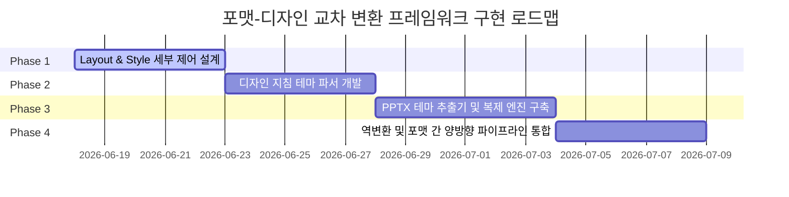

# [기획/구현계획서] 포맷-디자인 교차 변환 프레임워크 (v3)

본 계획서는 마크다운(MD), HTML(반응형 가이드 및 횡형 슬라이드), 파워포인트(PPTX) 간의 자유로운 포맷 변환과 디자인 템플릿/테마 시스템의 동적 이식을 가능하게 하는 통합 프레임워크 구축 계획안입니다.

---

## 1. 개요 (Overview)

본 프로젝트는 지식 문서의 생산성과 시각적 통일성을 극대화하기 위해, **"콘텐츠 포맷(MD, HTML, PPTX)"**과 **"디자인 스타일(Theme, Layout)"**을 완벽하게 분리하고 이들을 유기적으로 조합 및 상호 변환하는 **포맷-디자인 교차 변환 엔진**을 지향합니다.

```
                  ┌────────────────────────┐
                  │   디자인 지침서 Txt/MD  │
                  └───────────┬────────────┘
                              │ (테마 추출)
                              ▼
┌─────────────┐   ┌────────────────────────┐   ┌──────────────┐
│  마크다운   │ ◀ │ 디자인 토큰 (styles.json)│ ▶ │  PPTX/HTML   │
│ (Markdown)  │   │  레이아웃 (layout.json) │   │ 프레젠테이션 │
└─────────────┘   └────────────────────────┘   └──────────────┘
       ▲                       ▲                      ▲
       └───────────────────────┴──────────────────────┘
                         (상호 역변환)
```

---

## 2. 구현 로직 필요 사항 (Prerequisites)

### A. 디자인 및 레이아웃 독립 설정 제어
* **`layout.json` (설정 고도화)**: 
  * 기존 `pptdesign.config.json`과 `htmldesign.config.json`을 단일화하거나, 컴포넌트별 좌표/크기/정렬 방식을 오버라이드할 수 있는 `layout.json` 규격을 설계합니다.
  * 횡형 슬라이드 및 PPTX 내 본문 요소(카드, 단락, 표, 화살표)들의 정밀한 위치, 크기, 마진 조정을 템플릿 레벨에서 제어할 수 있는 매개변수 구조가 필요합니다.

### B. 디자인 지침(Design Spec) 기반 테마 파서
* 자연어 형태나 정형화된 지침 문서(텍스트/마크다운)를 해석하여 테마 색상(Hex 값), 폰트(글꼴명), 계층별 여백 단위를 자동으로 식별·추출하는 파서가 필요합니다.
* 파싱된 토큰 데이터를 `styles.json` 규격으로 자동 마이그레이션하는 유틸리티가 있어야 합니다.

### C. PPTX 바이너리 테마 추출
* 기존 파워포인트 파일(`.pptx`)을 압축 해제 및 XML 파싱 기법을 사용하여, PPTX 마스터 슬라이드에 정의된 색상 테마(`theme1.xml`), 레이아웃 정보 및 폰트 구성을 리버스 엔지니어링하여 추출해낼 수 있는 Node.js XML 분석 로직이 필요합니다.

---

## 3. 구현 계획 및 조합 (Combination & Composition)

이 프레임워크는 크게 **디자인 엔진(Design Engine)**과 **포맷 컴파일러(Format Compiler)**의 두 개 계층으로 모듈화되어 연동됩니다.

### 디자인 엔진 (Design Engine)
1. **Spec Parser**: 디자인 가이드라인 마크다운 문서 혹은 텍스트 지침서로부터 CSS 변수와 `styles.json` 프리셋 데이터를 상호 생성합니다.
2. **PPTX Theme Extractor**: 템플릿용 PPTX를 분석하여 컬러 스키마와 폰트 테마를 `styles.json`으로 내보냅니다.

### 포맷 컴파일러 (Format Compiler)
1. **MD ──(숏코드)──> HTML / PPTX**: 숏코드 명세를 기반으로 가이드 HTML, 횡형 슬라이드 HTML, PPTX 프레젠테이션으로 컴파일하며, 실시간으로 디자인 엔진의 테마 토큰을 주입받습니다.
2. **HTML / PPTX ──> MD (역변환)**: 퍼블리싱된 문서나 슬라이드 구조로부터 순수 본문 텍스트와 숏코드 구조를 유실 없이 복원합니다.

---

## 4. 상세 구현 계획 (Detail Phase)



### Phase 1: Layout & Style 세부 제어 (`layout.json` 설계 및 Part 1 구현)
* **목적**: 횡형 HTML 슬라이드 및 PPTX 내 본문 요소 위치 정밀 조정.
* **상세 작업**:
  * `config/layout.json` 규격을 신설하여, 각 숏코드(Grid, Flow, Terminal 등)가 슬라이드 내에서 가질 수 있는 폭(`width`), 오프셋(`top`, `left`), 본문 상하 정렬(`valign: middle/top`), 폰트 배율 파라미터를 명시적으로 구조화합니다.
  * `md-to-pptx.mjs` 및 `build-presentation.mjs`가 이 `layout.json` 설정 정보를 런타임에 동적으로 대입하여 렌더링 좌표와 박스 모델 크기를 계산하도록 리팩토링합니다.

### Phase 2: 디자인 지침 테마 파서 및 MD 순환계 구축 (Part 2 구현)
* **목적**: 텍스트 가이드라인 문서로부터 테마를 역생성하여 컴파일러와 숏코드에 즉시 주입.
* **상세 작업**:
  * 디자인 지침 텍스트 파일(예: `md_src/designspec/sample-content.md` 또는 스타일 명세서)을 파싱하여, 핵심 브랜딩 컬러 3색과 폰트 규칙을 추출하는 `scripts/designspec-theme-generator.mjs`를 작성합니다.
  * 마크다운 숏코드 지침과 연계되도록, 추출된 색상을 숏코드 컴포넌트 CSS/PPTX 브러시 컬러에 바인딩하여 디자인 지침 변경 시 전체 숏코드 미리보기 화면의 테마 컬러가 동기화되어 일괄 갱신되는 구조를 구축합니다.

### Phase 3: PPTX 테마 추출기 및 복제 엔진 구축 (Part 3 구현)
* **목적**: 임의의 파워포인트 파일로부터 테마(색상, 폰트, 레이아웃)를 추출하여 Raw PPTX에 주입.
* **상세 작업**:
  * Node.js 환경에서 `.pptx` 바이너리(실제 ZIP 포맷)를 읽어 `ppt/theme/theme1.xml`에서 `a:clrScheme`(테마 컬러 12색) 및 `a:majorFont`/`a:minorFont` 정보 XML을 추출 파싱하는 유틸리티를 제작합니다.
  * 추출된 테마 구성을 `styles.json` 테마 프리셋 형식으로 자동 저장하고, 신규 PPTX 변환 시 추출된 마스터 템플릿의 색상과 폰트 구조를 다른 Raw PPTX 및 변환 결과물에 복제 적용하는 파이프라인을 추가합니다.

### Phase 4: 역변환 및 포맷 간 양방향 파이프라인 통합 (Part 4 구현)
* **목적**: HTML/PPTX ──> MD 역변환 복원성 강화.
* **상세 작업**:
  * 앞서 백업해 둔 `html-to-md.mjs`, `html-to-pptx.mjs` 분석 결과를 토대로, 숏코드 규칙 매핑 파일과 디자인 지침을 대조하여 가이드 HTML 문서로부터 순수 마크다운 숏코드 원본을 무결성(Data Loss-Free) 있게 추출해 내는 리버스 컴파일 기능을 가이드 변환기 에디터와 정식 연동합니다.

---

## 5. 유의사항 및 한계점 (Risks & Limitations)

> [!WARNING]
> **1. PPTX 레이아웃 분석 한계**
> - PPTX 파일 포맷의 마스터 슬라이드 구조와 좌표 체계는 매우 복잡합니다. 따라서 템플릿 PPTX 파일로부터 복잡한 자유 도형 레이아웃 자체를 소스 코드로 온전히 역추적하여 복제하는 것은 어려우며, **컬러 팔레트(Color Palette), 폰트 스타일, 배경색상 테마** 및 **텍스트 슬라이드 템플릿** 정보를 타깃 파일에 주입하는 레벨로 범위를 한정하여 정밀도를 확보해야 합니다.
>
> **2. 역변환 정밀도 및 소스 유실 가능성**
> - HTML에서 마크다운 숏코드로 복원할 때, 사용자가 임의로 조작한 인라인 스타일(`style="..."`)이나 숏코드 매핑 표준 규격(`layout.json` 또는 `styles.json`) 외에 커스텀 마크업이 다수 존재할 경우 정밀도가 하락할 수 있습니다. 이를 방지하기 위해 정규화된 마크업 규칙을 강제하는 정제 필터(Sanitizer Filter)를 탑재해야 합니다.

---

## 6. 향후 과제 (Future Work)

* **AI 지능형 디자인 어시스턴트 연동**: 자연어로 작성된 브랜딩 설명(예: "NIPA의 신뢰감을 주는 푸른색 톤앤매너로, 헤드라인은 깔끔한 나눔고딕으로 맞춰줘")을 입력하면 AI가 직접 이 크로스 변환 엔진의 `layout.json`과 `styles.json` 토큰 값을 도출하여 실시간 컴파일 결과를 제공하는 지능형 모듈 추가.
* **통합 변환 에디터 GUI 완성**: `/converter.html` 화면 상에 "디자인 지침 업로드", "PPTX 테마 추출", "역변환 복원" 단추를 탭별로 배치하여 직관적으로 제어할 수 있는 올인원 변환기 콘솔 제공.
