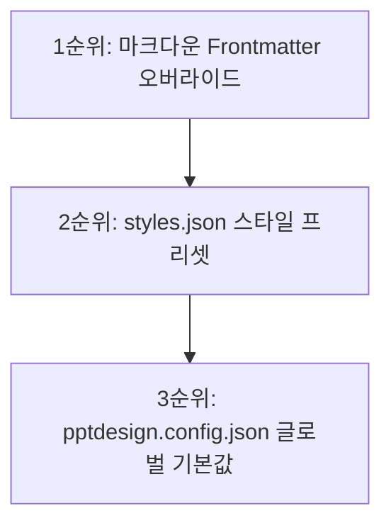

# Web(HTML) & PPTX 통합 폰트 그룹 및 테마 설정 가이드

본 문서는 웹(HTML 가이드 및 프레젠테이션)에서 사용하는 웹 폰트와 다운로드용 파워포인트(PPTX) 문서에서 사용하는 시스템 로컬 폰트를 완전히 분리하여 연동하고, 각 환경별로 폰트 그룹(대제목/중제목/본문)을 독립적으로 묶어 사용하는 방법에 대한 가이드입니다.

---

## 1. 굵기별 세분화된 폰트 페이스 지정 방법

파워포인트용 폰트(Paperlogy, Pretendard 등)는 굵기별로 폰트 페이스(FontFace) 이름 자체가 시스템에 다르게 등록되어 있는 경우가 많습니다. (예: `Paperlogy 4 Regular`, `Paperlogy 6 Medium`, `Paperlogy 8 Bold` 등)

기존 파워포인트 에디터에서 볼 수 있는 정확한 서체명(예: `Paperlogy 4`, `Paperlogy 6`, `Paperlogy 8` 등)을 폰트 그룹의 각 역할에 맞게 개별적으로 기재하면, 파워포인트 빌더(`md-to-pptx.mjs`)가 이를 정확히 구분하여 슬라이드에 개별 매핑합니다.

### 💡 3단 폰트 그룹 매핑 예시 (`Paperlogy` 기준)
* **대제목 폰트 (`fontTitle`)**: `"Paperlogy 8"` (굵고 묵직한 타이틀 서체)
* **중간제목 폰트 (`fontSubTitle`)**: `"Paperlogy 6"` (가독성이 확보된 적당한 두께의 서체)
* **본문 폰트 (`font` / `fontFace`)**: `"Paperlogy 4"` (본문 리드용 얇은 서체)

이처럼 문자열로 구분된 독립 서체명을 사용하면, 파워포인트가 시스템 폰트 폴백에 의존하지 않고 로컬에 설치된 정확한 두께의 폰트로 세밀하게 드로잉합니다.

---

## 2. PPTX 디자인 설정 및 오버라이드 계층구조 (우선순위)

PPTX 파일의 폰트 및 폰트 크기는 글로벌 기본값, 스타일 프리셋, 그리고 마크다운 파일(Frontmatter) 순으로 중첩 오버라이드(우선 적용)되는 구조로 설계되어 있습니다.



### 3순위: 글로벌 기본 디자인 설정 (`config/pptdesign.config.json`)
PPTX 폰트 크기 및 관련 스타일의 **원천(Source of Truth)**입니다. 폰트 관련 크기와 기본 서체는 이 파일 내의 설정들을 기준으로 제어됩니다.
```json
  "slide": {
    "font":        "Malgun Gothic",      // 본문 기본 폰트
    "fontTitle":   "Malgun Gothic",      // 대제목 기본 폰트
    "fontSubTitle":"Malgun Gothic",      // 중간제목 기본 폰트
    ...
  },
  "card": {
    "titleSize":     14,        // 소제목/카드 제목 폰트 크기 (pt)
    "bodySize":      11,        // 본문 텍스트 폰트 크기 (pt)
    "h3Size":        13,
    "codeSize":      10
  }
```

### 2순위: 스타일 프리셋 개별 설정 (`config/styles.json`)
스타일 테마별(예: `"custom-blue"`, `"creative"` 등)로 특정 PPTX 서체 패밀리와 폰트 크기를 다르게 묶어 제공하고자 할 때 사용합니다. 여기에 크기나 서체를 지정하면 3순위 글로벌 기본값이 무시되고 테마 지정값이 적용됩니다.
```json
  "custom-blue": {
    "label": "페이퍼로지 커스텀 블루 테마",
    ...
    // 🌐 웹 (HTML)용 폰트 그룹
    "webFont": "Malgun Gothic, sans-serif",
    "webFontTitle": "Malgun Gothic, sans-serif",
    
    // 📊 파워포인트 (PPTX)용 폰트 그룹 세분화 지정
    "pptxFont": "Paperlogy 4",
    "pptxFontTitle": "Paperlogy 8",
    "pptxFontSubTitle": "Paperlogy 6",
    
    // 📊 파워포인트 (PPTX)용 폰트 크기 오버라이드
    "titleSize": 14,
    "bodySize": 11
  }
```

### 1순위: 마크다운 파일 지정 (`Frontmatter`)
특정 개별 마크다운 문서에서 스타일 프리셋마저 오버라이드하여 일회성으로 커스텀 폰트 및 크기를 강제 적용하고 싶을 때 사용합니다. 가장 높은 우선순위를 지닙니다.
```yaml
---
title: "Claude Code CLI 자율 에이전트 마스터 가이드"
style: "custom-blue"

# 🌐 웹 (HTML)용 개별 폰트 오버라이드
webFont: "Pretendard, sans-serif"
webFontTitle: "Pretendard-Bold, sans-serif"

# 📊 파워포인트 (PPTX)용 개별 폰트/크기 최우선 오버라이드
fontFace: "Paperlogy 4"       # 본문
fontTitle: "Paperlogy 8"      # 대제목
fontSubTitle: "Paperlogy 6"   # 중간제목
titleSize: 15                 # 카드 제목 크기 강제 변경
bodySize: 12                  # 본문 크기 강제 변경
---
```

---

## 3. ⚠️ PPTX 폰트 적용 시 극히 중요한 사항

1. **폴백 쉼표(,) 금지**: `pptxFont: "Paperlogy 4, sans-serif"` 처럼 쉼표나 대체 폰트명을 쓰면 파워포인트가 폰트를 읽지 못해 **영문 자간 벌어짐이나 유니코드 깨짐**이 발생합니다. 반드시 `"Paperlogy 4"`와 같이 단일 이름만 입력해야 합니다.
2. **시스템 로컬 폰트 설치 유무 확인**: 지정하려는 폰트명(예: `Paperlogy 8`)이 해당 문서를 열어서 볼 사용자의 로컬 PC(Windows/Mac)에 실제로 설치되어 있어야 올바르게 보입니다. 설치되어 있지 않을 경우 OS 기본 글꼴로 대체 렌더링됩니다.
