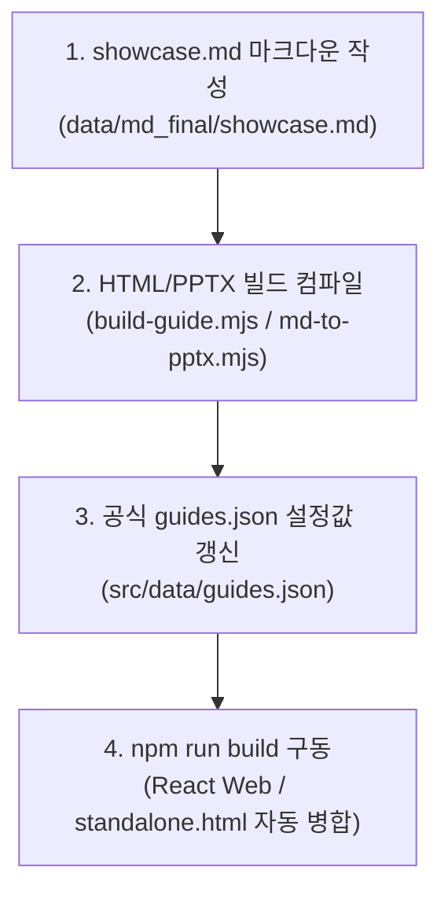

# 숏코드 쇼케이스 구축 및 공식 통합 작업 지침서

본 지침서는 Creative Spark v1.1 스펙(신형 표준 숏코드 및 3대 동적 시각화 특화 숏코드, 가변 격자 제어 등)을 총망라하는 **마스터 쇼케이스 리소스를 구축하고 아키텍처 규칙에 따라 파이프라인에 공식적으로 통합하는 작업 절차**를 다룹니다.

---

## 1. 빌드 및 통합 아키텍처 흐름

Creative Spark는 땜빵식의 수동 HTML 연동을 배척하며, **설정 기반 자동 통합 파이프라인**을 제공합니다. 마크다운 가이드를 작성하고 `src/data/guides.json`에 정식 등록하면, React 웹 및 스탠드얼론 단일 HTML 배포본에 경고 메시지 없이 우아하게 자동 통합 병합됩니다.



---

## 2. 세부 단계별 작업 절차

### [Step 1] 쇼케이스 마스터 마크다운 작성
* **정식 파일 위치**: `data/md_final/showcase.md`
* **작성 가이드**:
  - 기존 숏코드 12종(`plan-grid`, `feature-grid`, `compare-grid`, `columns-grid`, `stat-grid`, `step-list`, `workflow-strip`, `compare-split`, `bottom-list`, `alert-box`, `faq-list`, `console-box`)의 표준 치환 예제 수록.
  - v1.1 신규 3대 동적 시각화 특화 숏코드(`git-flow-strip`, `editor-box`, `network-box`) 종합 수록.
  - `cols=N` 가변 격자 단수 제어 기법 시연.

### [Step 2] HTML 및 PPTX 빌드 컴파일
* **HTML 생성 명령어**:
  ```bash
  node templates/build-guide.mjs data/md_final/showcase.md
  ```
  *(산출물: `public/guides/showcase.html` 정식 홈에 자동 안착)*
* **PPTX 생성 명령어**:
  ```bash
  node scripts/md-to-pptx.mjs data/md_final/showcase.md
  ```
  *(산출물: `dist-pptx/showcase.pptx` 정식 홈에 자동 안착)*

### [Step 3] `src/data/guides.json` 공식 설정 변경
* **파일 위치**: `src/data/guides.json`
* **설정 규칙**: `productivity` (생산성 유틸리티) 카테고리의 `guides` 목록 최하단에 `showcase` 정보를 공식 구조에 맞게 정식 추가합니다.
* **설정 코드**:
```json
{
  "slug": "showcase",
  "title": "숏코드 쇼케이스",
  "subtitle": "v1.1 신규 숏코드 시각화 종합 가이드",
  "file": "showcase.html"
}
```
> [!IMPORTANT]
> `file`의 경로를 정식 홈 위치인 `"showcase.html"`로 기재해주어야 standalone.html 빌드 엔진(`build-standalone.mjs`)이 누락 경고 없이 가이드를 완벽하게 식별하여 자동 병합을 수행할 수 있습니다.

### [Step 4] 빌드 및 통합 검증
* **실행 명령어**:
  ```bash
  npm run build
  ```
* **성공 지표**:
  - 빌드 로그 시 `missing` 경고 메시지가 0개로 소거되었는지 검증.
  - `public/standalone.html` 및 `dist/standalone.html`에 쇼케이스의 코드가 자동으로 병합 완료되었는지 확인 (빌드 용량이 약 45KB 증가함).

---

## 3. 백업 보존 안내
* **기존 쇼케이스 리소스 백업본 위치**:
  - 마크다운 백업: `public/showcase/showcase_backup.md`
  - HTML 백업: `public/showcase/showcase_backup.html`
  - PPTX 백업: `public/showcase/showcase_backup.pptx`
